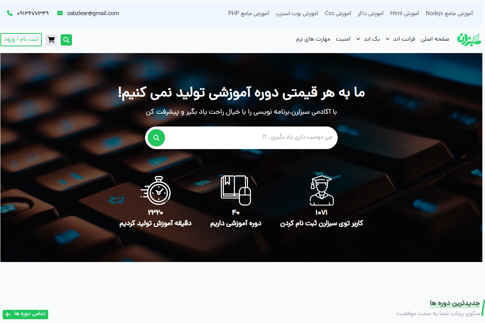
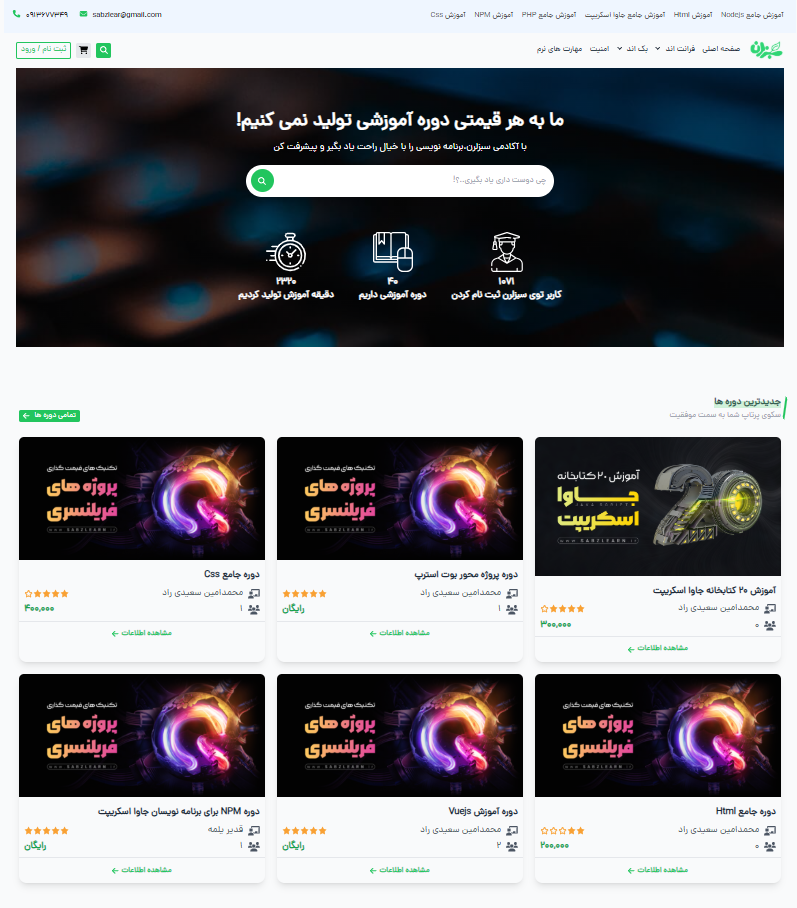
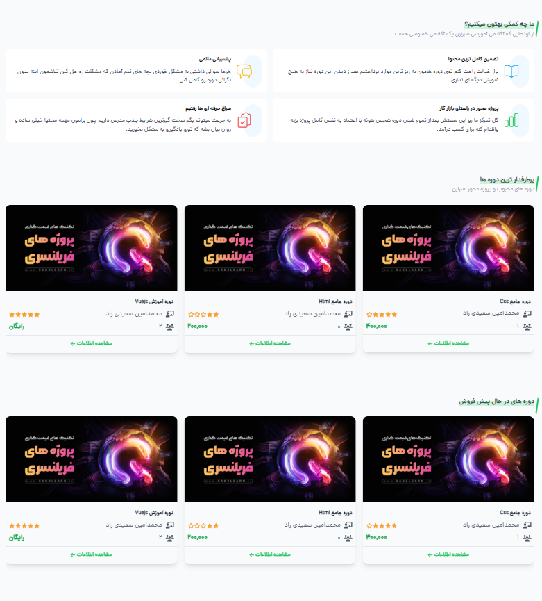
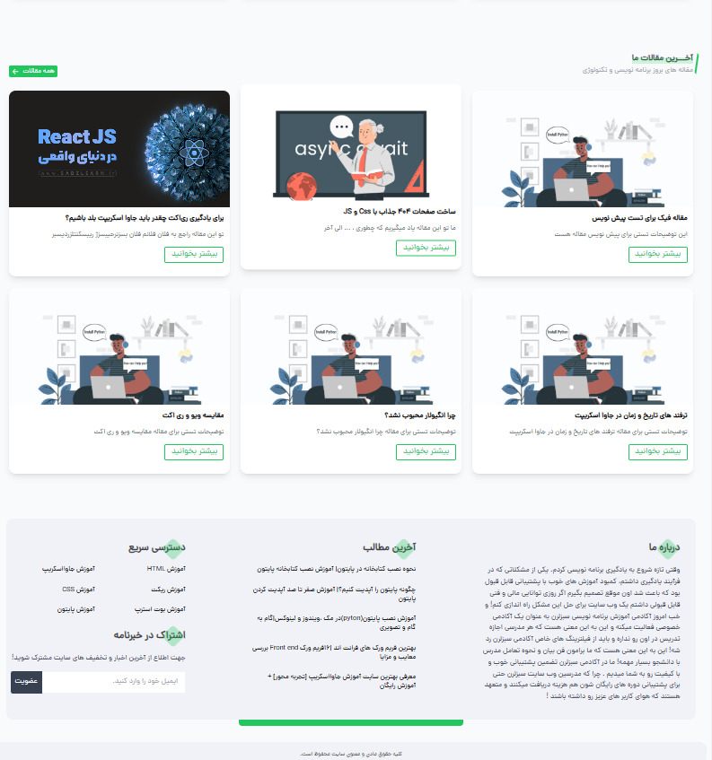
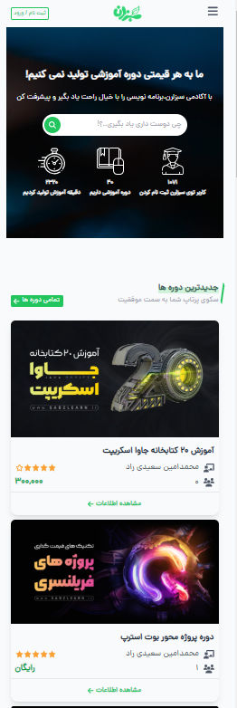
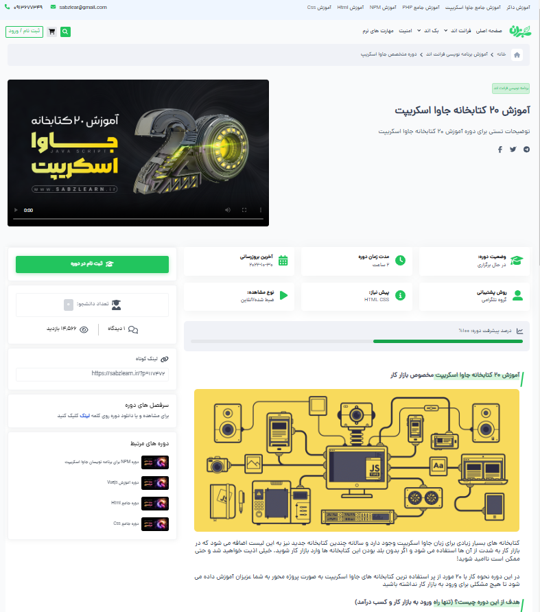
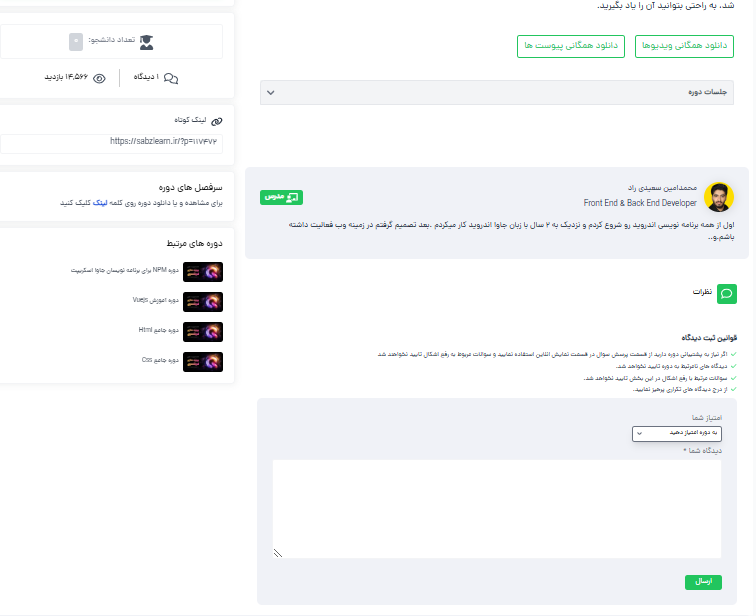
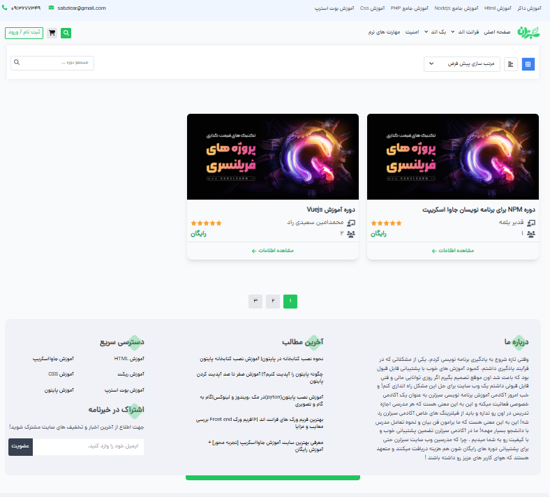

# وب‌سایت آموزشی برنامه‌نویسی


*تصویری از طراحی وب‌سایت*

این وب‌سایت آموزشی برای یادگیری زبان‌های برنامه‌نویسی و تکنولوژی‌های وب طراحی شده است و از فناوری‌های مدرن مانند **HTML5** و **CSS3** برای ساخت صفحات وب ساختاریافته و استایل‌دهی‌شده استفاده می‌کند. برای تعاملات پویا و دینامیک، از **جاوااسکریپت (ES6+)** بهره برده شده که با ویژگی‌هایی مانند **Async/Await** و **Modules** عملکردهای غیرهمزمان را بهبود می‌بخشد. برای ایجاد اسلایدرهای تعاملی و کاروسل‌های واکنش‌گرا از **Swiper.js** استفاده شده و از **SweetAlert** برای نمایش دیالوگ‌های هشدار کاربرپسند بهره گرفته شده است. طراحی رابط کاربری زیبا و پاسخگو با **Flowbite** و **Tailwind CSS** انجام شده و برای دریافت داده‌ها به صورت غیرهمزمان از **Fetch API** استفاده می‌شود. داده‌ها در پایگاه داده **MongoDB** ذخیره شده و برای ارتباط مؤثر بین فرانت‌اند و بک‌اند از **RESTful API** بهره گرفته شده است. همچنین کدهای **جاوااسکریپت** به صورت **ماژولار** نوشته شده‌اند تا پروژه به صورت مقیاس‌پذیر و قابل نگهداری باشد.

## ویژگی‌ها و فناوری‌های استفاده‌شده:

- **HTML5 و CSS3**
- **جاوااسکریپت (ES6+)**
- **Swiper.js**
- **SweetAlert**
- **Flowbite**
- **Tailwind CSS**
- **Fetch API**
- **MongoDB**
- **RESTful API**
- **جاوااسکریپت ماژولار**

## تصاویر سایت

برای بهبود تجربه بصری کاربران، از تصاویر استفاده شده که برخی از آن‌ها به عرض کامل صفحه کشیده می‌شوند:















## نحوه نصب و راه‌اندازی پروژه:

برای اجرای پروژه به صورت محلی، مراحل زیر را دنبال کنید:

### 1. کلون کردن مخزن:
ابتدا این مخزن را کلون کنید:
```bash
git clone https://github.com/your-username/project-name.git
برای راه‌اندازی پروژه به صورت محلی از دستور زیر استفاده کنید:
npm run dev
